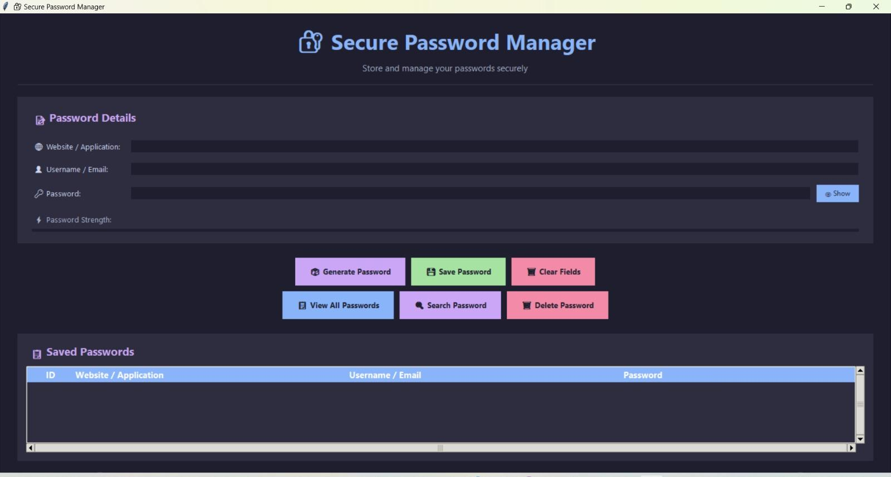
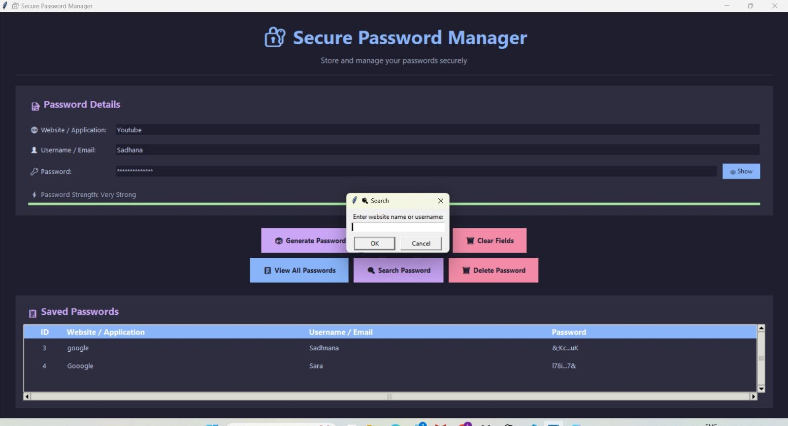

# Secure Password Manager

## Overview
Secure Password Manager is a Python-based application that helps users securely store and manage their passwords. The project uses encryption techniques to protect sensitive information and provides a simple interface for password management.

## Features
- Store passwords securely
- Encrypt sensitive data
- Generate strong passwords
- Retrieve saved passwords
- Password strength analysis
- User-friendly interface

## Screenshots

### Main Application


### Password Generation


### Search Feature


## Technologies Used
- Python
- Cryptography Library
- File Handling
- SQLite Database

## Project Structure
- `main.py` - Main application file
- `database.py` - Handles password storage
- `encryption.py` - Encrypts and decrypts data
- `password_generator.py` - Generates secure passwords

## How to Run
1. Clone the repository
2. Install dependencies:
   ```bash
   pip install cryptography
   ```

**Run the application:**
```bash
python main.py
```

**Future Enhancements**
GUI support
Cloud backup
Multi-user authentication

**Author**
Sadhana Arul
